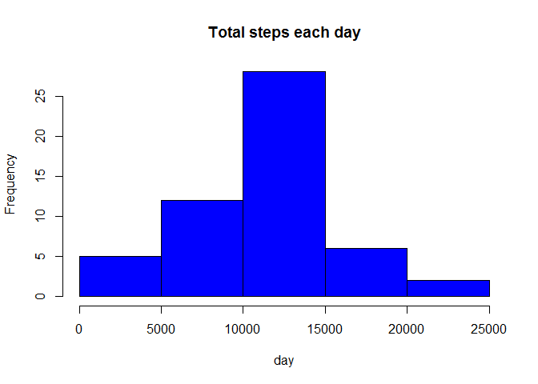
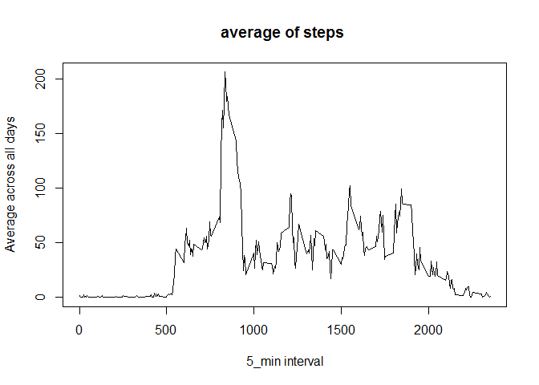
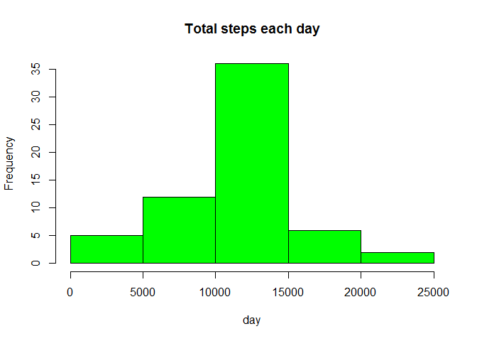
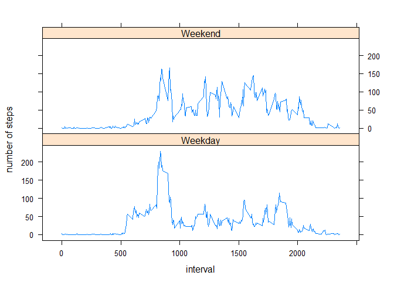

# Reproducible Research: Peer Assessment 1


## Loading and preprocessing the data

```r
dat <- read.csv("activity.csv", header = TRUE)
dat$date <- as.Date(dat$date,"%Y-%m-%d")
head(dat)
```

```
##   steps       date interval
## 1    NA 2012-10-01        0
## 2    NA 2012-10-01        5
## 3    NA 2012-10-01       10
## 4    NA 2012-10-01       15
## 5    NA 2012-10-01       20
## 6    NA 2012-10-01       25
```


## What is mean total number of steps taken per day?

```r
agg <- aggregate(steps ~ date, data = dat, sum, na.rm = TRUE)
with(dat, hist(agg$steps, col = "blue", main = "Total steps each day", xlab = "day"))
```

 
calculating the mean and median

mean


```r
mean(agg$steps)
```

```
## [1] 10766.19
```

median


```r
median(agg$steps)
```

```
## [1] 10765
```

## What is the average daily activity pattern?

```r
x <- tapply(dat$steps,dat$interval, mean ,na.rm = TRUE)
plot(row.names(x),x, type ="l",xlab = "5_min interval", 
    ylab = "Average across all days", main = "average of steps ")
```

 


## Imputing missing values
number of missing values

```r
sum(is.na(dat))
```

```
## [1] 2304
```

filling in missing values

```r
Stepavg <- aggregate(steps ~ interval, data = dat, FUN = mean)
fill <- numeric()
for (i in 1:nrow(dat)) {
    obs <- dat[i, ]
    if (is.na(obs$steps)) {
        steps <- subset(Stepavg, interval == obs$interval)$steps
    } else {
        steps <- obs$steps
    }
    fill <- c(fill, steps)
}
```
Creating a new dataset 


```r
dat2 <- dat
dat2$steps <- fill
```


the new histogram


```r
agg2 <- aggregate(steps ~ date, data = dat2, sum, na.rm = TRUE)
with(dat2, hist(agg2$steps, col = "green", main = "Total steps each day", xlab = "day"))
```

 


mean of the new data
 

```r
mean(agg2$steps) 
```

```
## [1] 10766.19
```

median of the new data


```r
median(agg2$steps)
```

```
## [1] 10766.19
```

## Are there differences in activity patterns between weekdays and weekends?
Creating of new factor variable with two levels weekday and weekend .


```r
day <- weekdays(dat2$date)
daylevel <- vector()
for (i in 1:nrow(dat2)) {
    if (day[i] == "Saturday") {
        daylevel[i] <- "Weekend"
    } else if (day[i] == "Sunday") {
        daylevel[i] <- "Weekend"
    } else {
        daylevel[i] <- "Weekday"
    }
}
dat2$daylevel <- daylevel
dat2$daylevel <- factor(dat2$daylevel)

agg3 <- aggregate(steps ~ interval + daylevel, data = dat2, mean)
names(agg3) <- c("interval", "daylevel", "steps")
```

the plot showing diffrence of patterns   
between weekdays and weekends


```r
library(lattice)
xyplot(steps ~ interval | daylevel, agg3, type = "l", layout = c(1, 2), 
    xlab = "interval", ylab = "number of steps")
```

 
